Redux Basics

  
  
  
  
  
  
  
  
  

  Three Core Concepts

  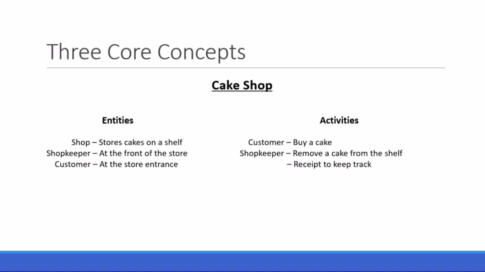
  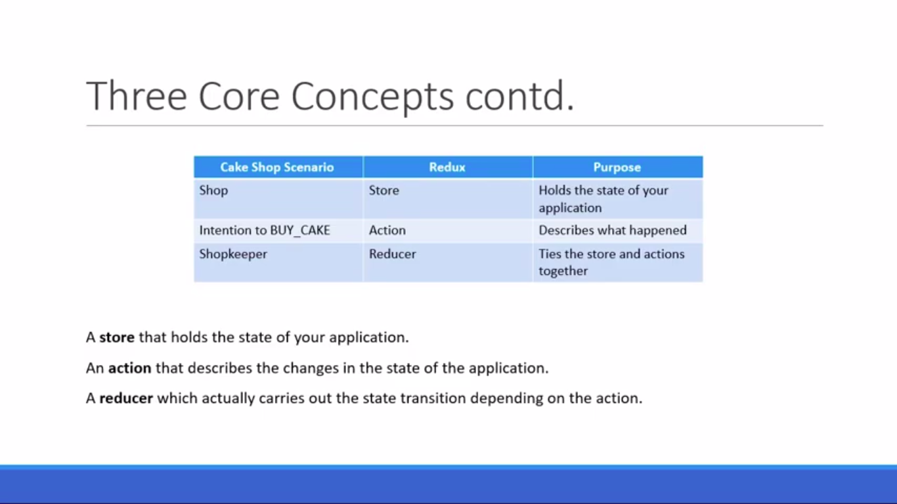

  Three Principles

  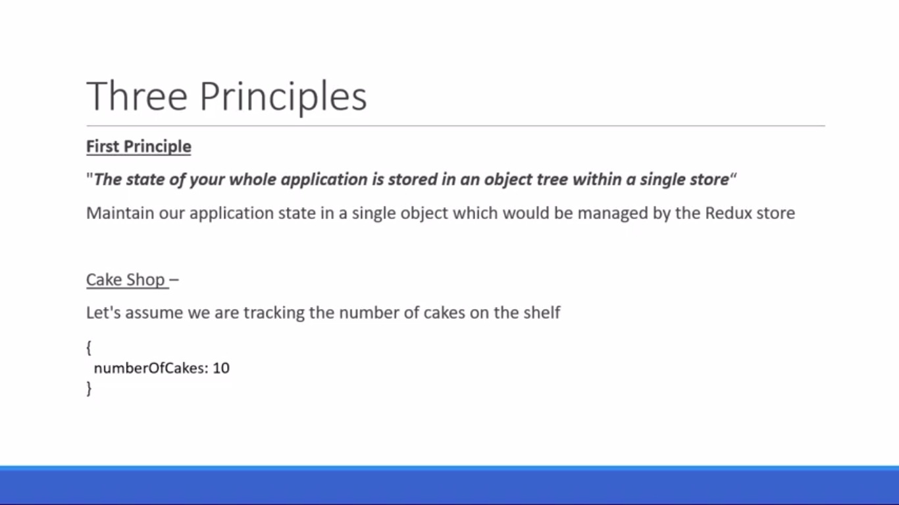
  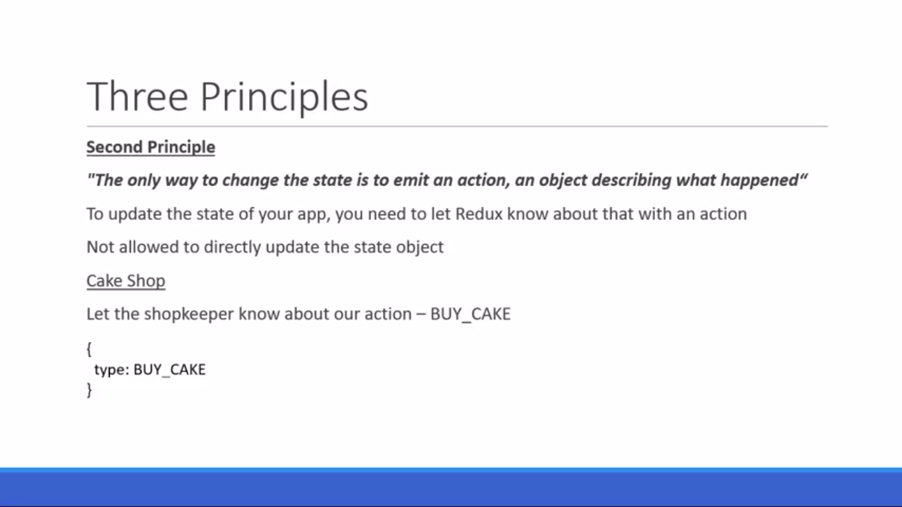
  
  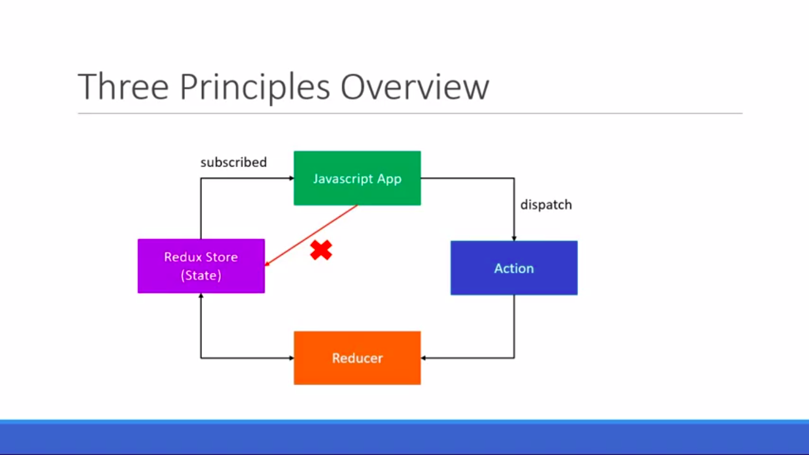

  Actions

  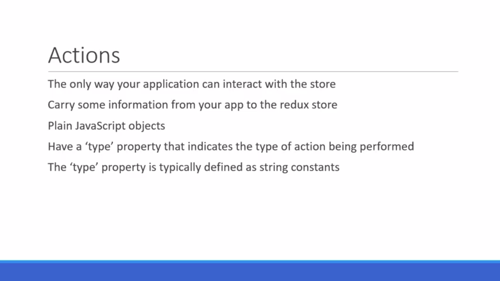
  
  Reducers

  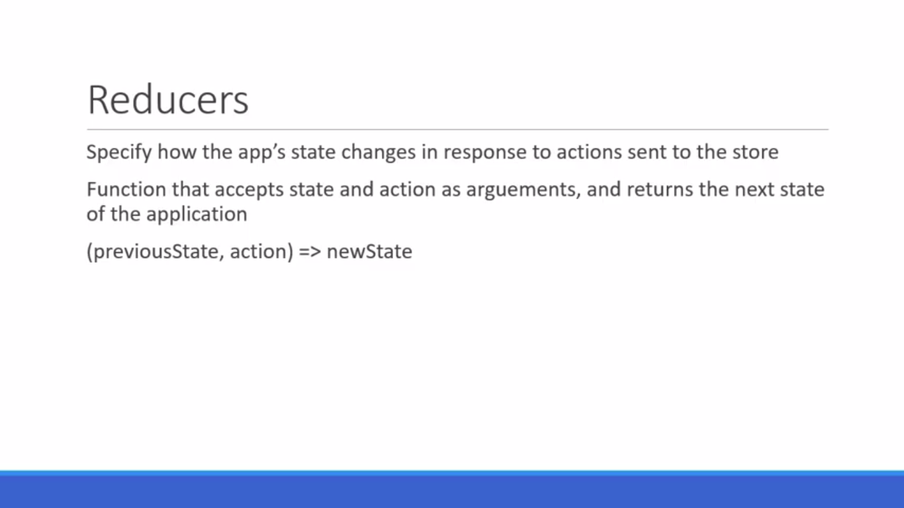

  Store

  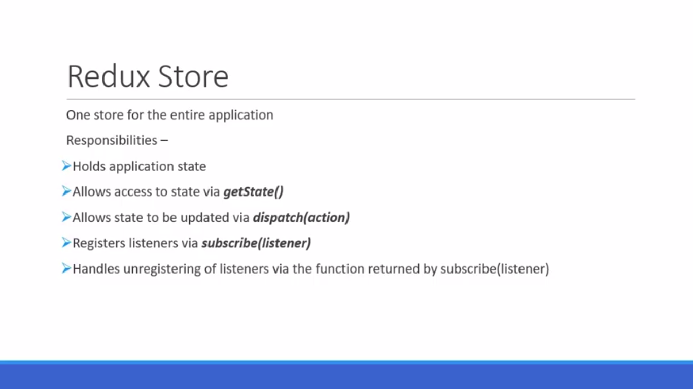

  MiddleWare

  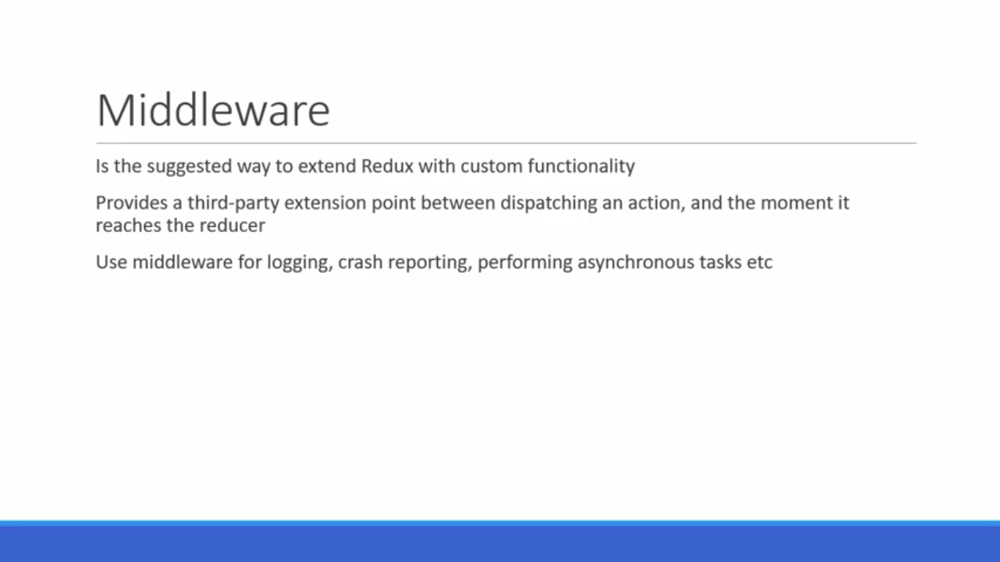

  Async Actions

  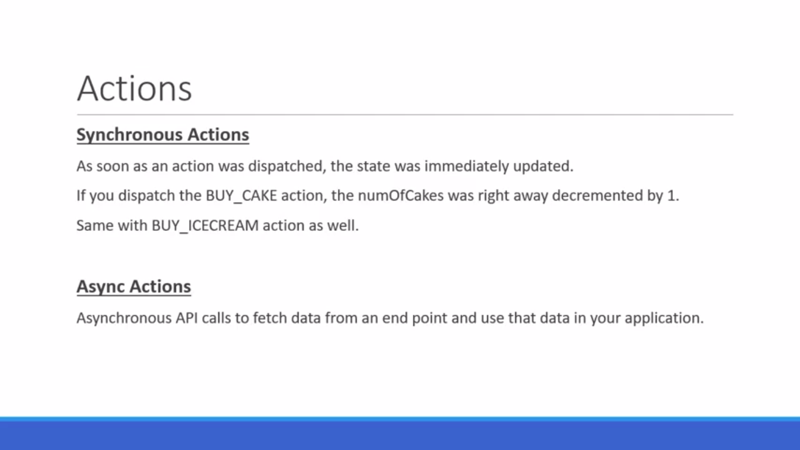
  
  
  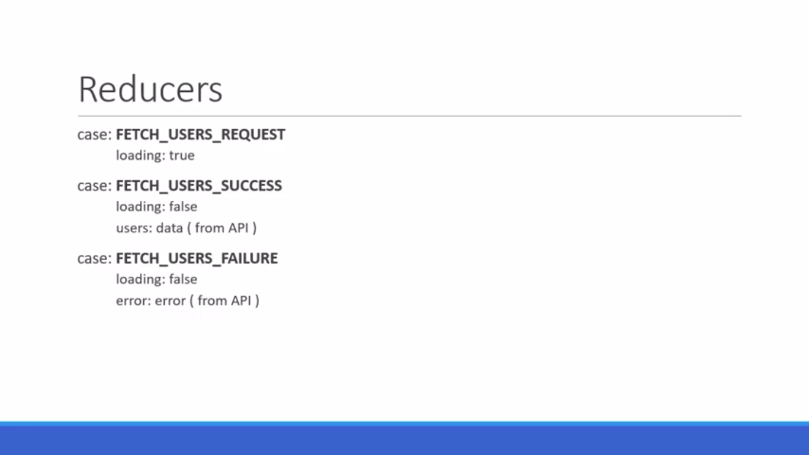
  